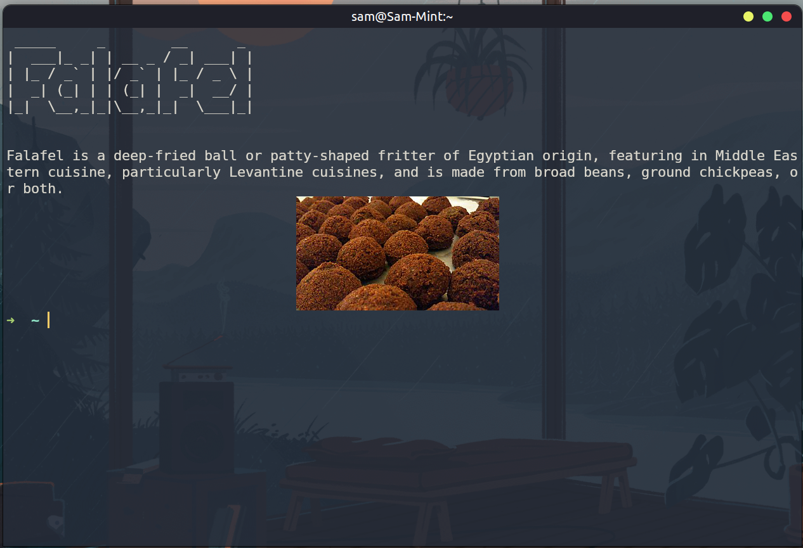

# wiki-fun-fact
Ever wanted to learn more about a topic while doing your day-to-day programming? Do you like Wikipedia? Do you also use a Linux-based operating system? Well, wiki-fun-fact may just be for you! 

### Want to run the application?

1. Download the prerequisites for viewing images (optional, but required if you want to run the script without the `--no-image` flag.) Your system is required to have any one of the following programs: https://github.com/atanunq/viu, https://sw.kovidgoyal.net/kitty/, or https://w3m.sourceforge.net/.

2. Clone this repository, make the script executable `chmod +x wiki_fun_fact.bin` and then run it `./wiki_fun_fact.bin Category1 Category2`, e.g., `./wiki_fun_fact.bin Gardening Mythology Coffee`. If you don't want an image (or your terminal doesn't support them, you can disable images using the `--no-image` flag.) **Note:** Categories must be valid Wikipedia categories. Check out: https://en.wikipedia.org/wiki/Wikipedia:Contents/Categories.

### Want to build it yourself?
Clone this repository --> install pipx `python3 -m pip install pipx` --> install poetry `pipx install poetry` --> install python dependencies (while in project directory) `poetry install` --> switch to the poetry environment by running `poetry env list` and then `poetry env use ENV_NAME` where ENV_NAME is the name of the environment from the previous command, should look something like this: `wiki-fun-fact-LEsSV_Q2-py3.12` --> then build the script and follow instructions for running above `chmox +x build.sh` --> `./build.sh`.

PSA: I made this over the course of a single night in a bout of __extreme__ procrastination. There are most likely bugs in this code.

Happy coding :)